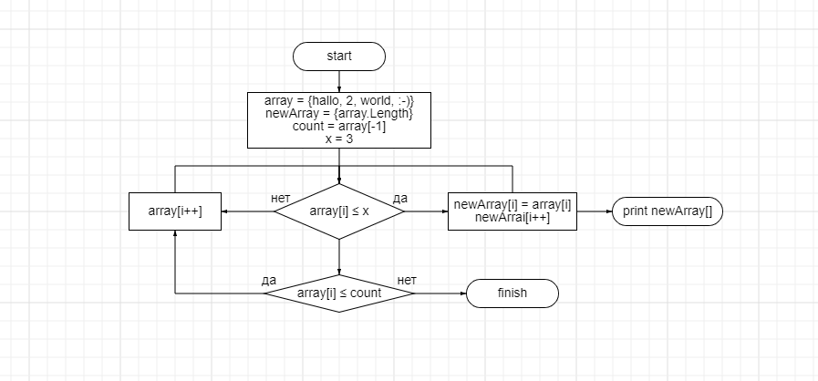
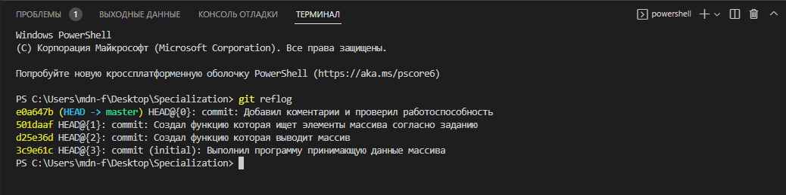

Итоговая проверочная работа.
Задача: Написать программу, которая из имеющегося массива строк формирует массив из строк, длина которых меньше либо равна 3 символа. Первоначальный массив можно ввести с клавиатуры, либо задать на старте выполнения алгоритма. При решении не рекомендуется пользоваться коллекциями, лучше обойтись исключительно массивами.
Пример:
["hello", "2", "world", ":-)"] -> ["2", ":-)"]
["1234", "1567", "-2", "computer science"] -> ["-2"]
["Russia", "Denmark", "Kazan"] -> []

Алгоритм решения:
создаем массив
наполняем массив строками (ввод в консоли)
производим подсчета количества элементов в массиве, длина которых меньше либо равна 3 символа
создаем новый массив размером, равным количеству подсчитанных элементов
наполняем новый массив элементами, длина которых меньше либо равна 3 символа
выводим на печать исходный массив, символ " -> " и новый массив

Ссылка на репозиторий на GitHub: https://github.com/FoxDes/FinalTest.git
Блок-схема алгоритма (основана на псевдокоде): 
Алгоритм решения: создаём вспомогательный массив "res" такой же длины, как и первоначально заданный "array", по умолчанию заполненный нулевыми элементами (в C# для типа данных string таким элементом является null значение) и заполняем элементами длина которых меньше либо равна 3 по условию задачи. Считаем количество не нулевых элементов в полученном вспомогательном массиве. На основании этого числа инициализируем целевой массив длинной равной количеству подсчитанных не нулевых значений во вспомогательном массиве.
При решении данной задачи были выполнены последовательно сделанные коммиты: 